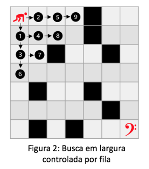
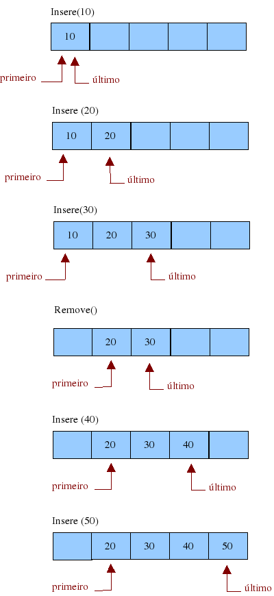

<h1># BFS (breadht-first search): Implementação em C</h1>

 

 
</a> 

 

 

O BFS ou Busca em largura é um algoritmo que percorre uma matriz nxn, desde o ponto inicial (0,0) até o ponto final (n,n), passando no máximo uma vez em cada posição, com a finalidade de percorrer o labirinto;

	 

Observando a figura acima, é visível que a matriz será percorrida por meio de fila, onde serão testadas todas as posições até o algoritmo conseguir alcançar a última posição.

Com relação a estruturas da fila, será dinâmica. Isto significa que há um ponteiro apontando para o ínicio e outro apontando para o fim da estrutura, e entre eles são passados os dados.

É possível observar o funcionamento da fila pela imagem a seguir:

	 

 

Explicado o básico das estruturas vamos ao funcionamento do código.

<h1># Algoritmo</h1>

 

O algoritmo usa de uma matriz onde:
    <ul>
        <li>Posição válida = 0;</li>
        <li>Posição inválida = #;</li>
    </ul>

    Com a função PercorreLabirinto() usando a estrutura de fila dinamica, ele percorre o labirinto, iniciando no ponto (0,0), de forma que a cada teste em uma posição do labirinto, ele caminha e testa a validade de suas casas vizinhas . Após cada um dos testes as opções são armazenadas gerando uma única fila e retornando a quantidade de posições que foram necessárias para percorrer o labirinto.
    O programa irá executar o PercorreLabirinto() até chegar no ultimo numero da ultima coluna que será definido pela função VerificarUltimo() que ficará responsavel por ver se o codigo ja passou pela aquela posição.
   

<h1># Compilação e Execução</h1>

 

O algoritmo disponibilizado possui um arquivo Makefile que realiza todo o procedimento de compilação e execução. Para tanto, temos as seguintes diretrizes de execução:
 
 
<body>
    <table border="1px" align="center">
        <tr >
            <td align="center"><h3>Comando</h3></td>
            <td align="center"><h3>Função</h3></td>
        </tr>
        <tr>
            <td>make clean</td>
            <td>Apaga a última compilação realizada contida na pasta build</td>
        </tr>
        <tr>
            <td>make</td>
            <td>Executa a compilação do programa utilizando o gcc, e o resultado vai para a pasta build</td>
        </tr>
        <tr>
            <td>make run</td>
            <td>Executa o programa da pasta build após a realização da compilação</td>
        </tr>
    </table>
</body>
 

